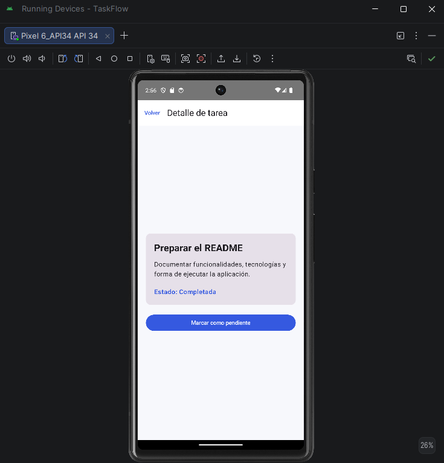

# TaskFlow - Laboratorios y Proyecto Integrador

Aplicación Android para la gestión de tareas personales, desarrollada con Kotlin, Jetpack Compose y Material 3. Integra las competencias trabajadas en los **Laboratorios 0, 1+2, 3, 5 y 6** del curso.

---

## 📌 Contenido de los Laboratorios Implementados

### 🟢 Lab 0: Nivelación - Scaffold, Navigation e Intent
* **Estructura con Scaffold**: Uso de `topBar`, `floatingActionButton` (para agregar tareas mediante un `AlertDialog`) y `content` adaptado a `PaddingValues`.
* **Navegación Robusta**: Implementación de `NavHost` + `NavController`, pasando argumentos dinámicos entre pantallas (`itemId`), usando `navigate()` y `popBackStack()`.
* **Intent Implícito y Selector**: Botón **"Compartir"** en la pantalla de detalle que dispara un `Intent` implícito (`ACTION_SEND`) con `Intent.createChooser(...)`.
* **Documentación en código**: Comentario pedagógico explicando la diferencia conceptual entre un **Intent Explícito** y un **Intent Implícito**.

---

### 🔵 Lab 1+2: Librería Genérica con Estilo Funcional
* **Librería Genérica (`ContenedorProcesable<T>`)**: Ubicada en `com.josue.taskflow.util`.
* **Varianza**: Firma de métodos con proyecciones de tipo `Array<out T>` (covariante) y `MutableList<in T>` (contravariante).
* **Type Bounds**: Funciones de comparación y ordenamiento (`obtenerMaximo()`, `obtenerMinimo()`, `ordenar()`) restringidas con `where T : Comparable<T>`.
* **Filtrado Inline Reified**: `inline fun <reified R : T> filtrarPorTipo(): List<R>` para inspección de tipos en tiempo de ejecución.
* **Operadores Funcionales**: Uso de `map` (`transformar`), `filter` (`filtrar`), `fold` (`acumular`) y `reduce` (`reducir`).
* **Scope Functions**: Aplicación de `let`, `run`, `also`, `apply` y `with`, con comentarios explicativos en el código.
* **Pruebas Unitarias**: Suite de 12 pruebas unitarias automatizadas (`ContenedorProcesableTest.kt`) pasando al 100%.

---

### 🟠 Lab 3: Concurrencia y Corrutinas
* **Migración de Callback a Suspend**: Adaptación de APIs asíncronas heredadas basadas en callbacks a funciones suspendidas utilizando `suspendCancellableCoroutine`.
* **Módulo de Sincronización (`MatchSyncService`)**: Gestión de tareas en segundo plano usando `Dispatchers.Main.immediate` y control de ciclo de vida con `Job`.
* **Cancelación Cooperativa**: Implementación de sincronización periódica (*polling*) que responde de forma inmediata a `cancelAndJoin()`.
* **Evidencia en Logs**: Verificación en Logcat (`LAB3`) de que la cancelación se ejecuta limpiamente (`activeCalls=0`).

---

### 🟣 Lab 5: MVVM + Clean Architecture (Presentación, Dominio y Datos)
* **Capa de Dominio (`com.josue.taskflow.dominio`)**:
  - **`model.Tarea`**: Modelo de datos de Kotlin puro sin dependencias de Android, Room o Retrofit.
  - **`repository.TareaRepository`**: Interfaz abstracta con funciones `suspend` y `Flow` (Inversión de Dependencias).
  - **Casos de Uso (`usecase`)**: `ObtenerTareasUseCase`, `AgregarTareaUseCase`, `CambiarEstadoTareaUseCase` implementando `operator fun invoke()`.
* **Capa de Datos (`com.josue.taskflow.datos`)**:
  - **`repository.TareaRepositoryImpl`**: Implementación de la interfaz de dominio.
* **Capa de Presentación (`com.josue.taskflow.presentacion`)**:
  - **`viewmodel.TareaViewModel`**: Expone `UiState` mediante `StateFlow` y depende exclusivamente de los Casos de Uso.
  - **`state.TareaUiState`**: Estado inmutable para la UI siguiendo el patrón Unidirectional Data Flow (**UDF**).
  - **Composables**: Desacoplados de la lógica de negocio applying *"State Down, Events Up"*.

---

### 🟤 Lab 6: Capa de Datos con Room Database (CRUD vía Flow)
* **Componentes de Room (`com.josue.taskflow.datos.db`)**:
  - **`TareaEntity`**: Entidad para la tabla SQLite `tareas`, con mappers `toDomain()` y `toEntity()`.
  - **`TareaDao`**: DAO que expone consultas reactivas mediante `Flow<List<TareaEntity>>` e inserciones/actualizaciones con `suspend`.
  - **`TaskFlowDatabase`**: Singleton de `RoomDatabase` configurado con prepoblación de datos iniciales.
* **`TareaRepositoryImpl` con Room**: Sustituye la fuente en memoria por Room consumiendo `TareaDao`.
* **Aislamiento Arquitectural**: **Ni el UseCase, ni el ViewModel, ni los Composables sufrieron modificaciones en su lógica o firmas**, cumpliendo estrictamente con la Inversión de Dependencias.
* **Evento One-time con Channel**: Implementado `Channel<String>` en `TareaRepositoryImpl` para emitir eventos de confirmación instantáneos (ej. *"Elemento guardado en Room"*).

---

## 📸 Evidencias y Capturas de Pantalla

### Capturas del Flujo de Interfaz

| Pantalla de Inicio | Pantalla de Lista | Pantalla de Detalle |
| :---: | :---: | :---: |
|  |  |  |

### Evidencia en Logs de Cancelación en Corrutinas (Lab 3)

Muestra del log en Android Studio confirmando la invocación de `cancelAndJoin()`, la cancelación del polling (`CANCELLED T-TIGRES`) y la liberación completa de recursos (`activeCalls=0`):



---

## 🛠️ Tecnologías Utilizadas

* **Kotlin 2.x** (Genéricos, Varianza, Reified, Scope Functions, Corrutinas)
* **Room Database 2.6.1** & **KSP**
* **Arquitectura MVVM + Clean Architecture**
* **Unidirectional Data Flow (UDF)** con `StateFlow` y `ViewModel`
* **Jetpack Compose** & **Material 3**
* **Navigation Compose 2.9.8**
* **KotlinX Coroutines & Channels** (`suspendCancellableCoroutine`, `cancelAndJoin`, `Channel.receiveAsFlow()`)
* **JUnit 4** para pruebas unitarias de la librería genérica

---

## 🚀 Cómo Ejecutar el Proyecto

1. Clonar este repositorio:
   ```bash
   git clone https://github.com/Josuesolo30/TaskFlow.ProyectoFinalProgMovil1.git
   ```
2. Abrir el proyecto en **Android Studio**.
3. Sincronizar los archivos de Gradle.
4. Para ejecutar las pruebas unitarias del Lab 1+2:
   ```bash
   ./gradlew test
   ```
5. Para ejecutar la aplicación en el emulador: seleccionar el módulo `app` y presionar **Run** (Shift + F10).

---

## 👤 Autor

**Josue Rafael Piña Fermin**  
Estudiante de UNICDA  
Asignatura: Desarrollo Android con Kotlin
