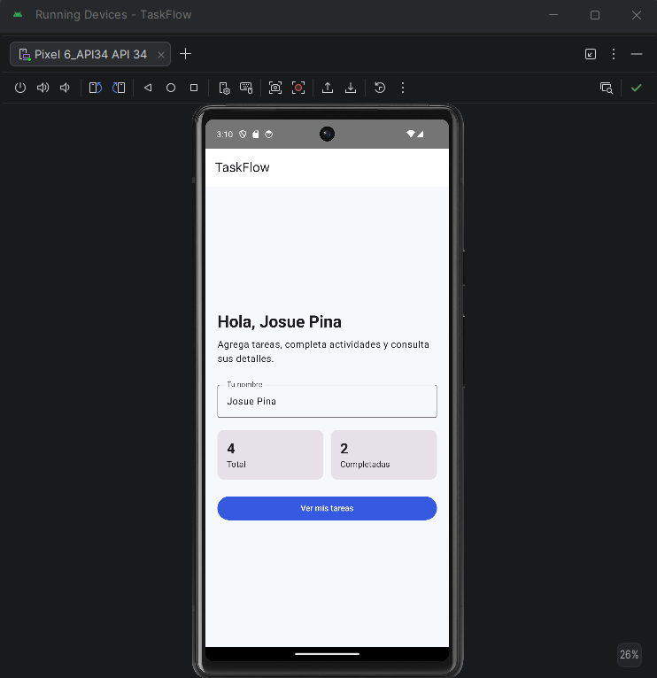
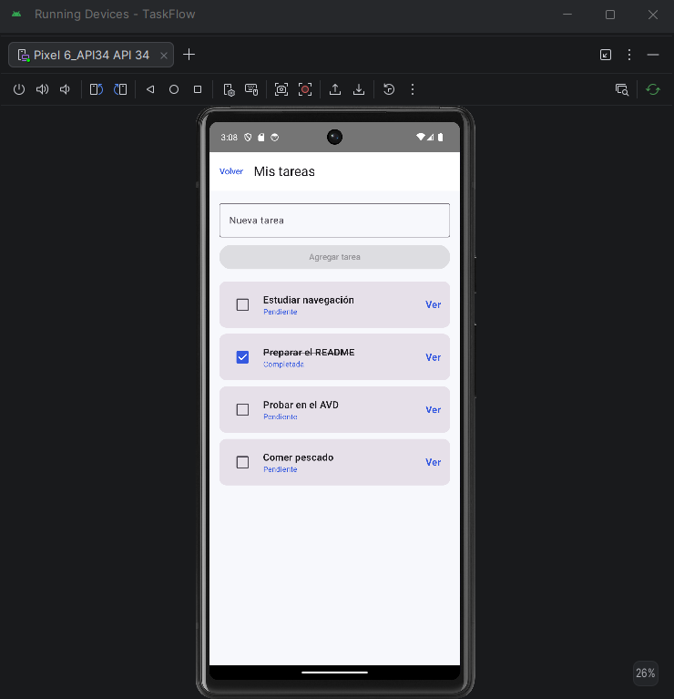

# TaskFlow

Aplicación Android para la gestión de tareas personales, desarrollada con Kotlin, Jetpack Compose y Material 3 como proyecto integrador final de la asignatura Desarrollo Android con Kotlin.

## Descripción

TaskFlow permite al usuario organizar sus tareas personales de una manera sencilla. La aplicación permite visualizar tareas, agregar nuevas tareas, marcar tareas como completadas y consultar los detalles de cada una.

El proyecto fue diseñado para demostrar el uso de navegación entre pantallas, manejo de estado, listas dinámicas y componentes reutilizables en Jetpack Compose.

## Problema que resuelve

Muchas personas necesitan una herramienta sencilla para recordar y organizar sus actividades diarias.

TaskFlow ayuda al usuario a:

* Registrar tareas pendientes.
* Visualizar todas sus tareas.
* Marcar tareas como completadas.
* Consultar la información de una tarea específica.
* Mantener sus actividades organizadas desde una aplicación móvil.

## Funcionalidades

* Pantalla de bienvenida.
* Registro del nombre del usuario.
* Visualización de tareas de ejemplo.
* Creación de nuevas tareas.
* Lista vertical utilizando `LazyColumn`.
* Marcado de tareas como completadas.
* Navegación entre tres pantallas.
* Visualización de los detalles de una tarea.
* Manejo de estado con `remember` y `rememberSaveable`.
* Diseño basado en Material 3.
* Tema personalizado con colores propios.

## Pantallas

### 1. Pantalla de inicio

Muestra el nombre de la aplicación y un campo donde el usuario puede escribir su nombre.

Desde esta pantalla, el usuario puede acceder a su lista de tareas.

### 2. Pantalla de lista

Muestra las tareas registradas dentro de una `LazyColumn`.

En esta pantalla el usuario puede:

* Agregar una nueva tarea.
* Marcar una tarea como completada.
* Seleccionar una tarea.
* Acceder a la pantalla de detalle.

### 3. Pantalla de detalle

Muestra la información completa de la tarea seleccionada.

Esta pantalla recibe el identificador de la tarea mediante Navigation Compose.

## Diagrama de navegación

```text
Pantalla de inicio
        |
        | Botón "Ver tareas"
        v
Pantalla de lista
        |
        | Seleccionar una tarea
        v
Pantalla de detalle
        |
        | Botón regresar
        v
Pantalla de lista
```

## Tecnologías utilizadas

* Kotlin 2.x
* Android Studio
* Jetpack Compose
* Material 3
* Navigation Compose
* `LazyColumn`
* `remember`
* `rememberSaveable`
* Git
* GitHub

## Estructura del proyecto

```text
com.josue.taskflow/
├── MainActivity.kt
├── data/
│   ├── Tarea.kt
│   └── TareaRepository.kt
├── ui/
│   ├── components/
│   │   └── TareaCard.kt
│   ├── navigation/
│   │   └── AppNavigation.kt
│   ├── screens/
│   │   ├── InicioScreen.kt
│   │   ├── ListaScreen.kt
│   │   └── DetalleScreen.kt
│   └── theme/
│       ├── Color.kt
│       ├── Theme.kt
│       └── Type.kt
```

## Explicación de los archivos principales

### `MainActivity.kt`

Es el punto de entrada de la aplicación. Inicia Jetpack Compose, aplica el tema visual y llama al sistema de navegación.

### `Tarea.kt`

Contiene la `data class` que representa una tarea.

Cada tarea tiene:

* Identificador.
* Título.
* Descripción.
* Estado de completada o pendiente.

### `TareaRepository.kt`

Contiene los datos de ejemplo utilizados al iniciar la aplicación.

### `AppNavigation.kt`

Centraliza las rutas y controla la navegación entre las pantallas.

También se encarga de recibir el identificador de la tarea seleccionada.

### `InicioScreen.kt`

Contiene la pantalla de bienvenida y el campo para escribir el nombre del usuario.

### `ListaScreen.kt`

Contiene el formulario para agregar tareas y la lista creada con `LazyColumn`.

### `DetalleScreen.kt`

Muestra la información de la tarea seleccionada.

### `TareaCard.kt`

Es un componente reutilizable que representa visualmente cada tarea dentro de la lista.

## Manejo de estado

El proyecto utiliza `rememberSaveable` para conservar información sencilla, como el nombre escrito por el usuario o el texto introducido en los campos.

Ejemplo:

```kotlin
var nombre by rememberSaveable {
    mutableStateOf("")
}
```

La lista de tareas se mantiene como un estado observable para que la interfaz se actualice cuando el usuario agrega o modifica una tarea.

## Navegación

Las rutas están organizadas mediante una clase sellada:

```kotlin
sealed class Pantalla(val ruta: String) {
    object Inicio : Pantalla("inicio")
    object Lista : Pantalla("lista")

    object Detalle : Pantalla("detalle/{itemId}") {
        fun crearRuta(id: Int): String = "detalle/$id"
    }
}
```

La pantalla de detalle recibe el identificador de la tarea mediante la ruta:

```text
detalle/1
```

## Requisitos para ejecutar el proyecto

* Android Studio instalado.
* Android SDK configurado.
* Emulador Android o dispositivo físico.
* Conexión a internet para descargar dependencias.
* JDK compatible con Android Studio.

## Cómo ejecutar el proyecto

1. Clonar o descargar este repositorio.
2. Abrir Android Studio.
3. Seleccionar **Open**.
4. Elegir la carpeta del proyecto.
5. Esperar la sincronización de Gradle.
6. Crear o seleccionar un emulador Android.
7. Presionar el botón **Run**.
8. Esperar que la aplicación se instale y abra en el dispositivo.

## Dependencia de navegación

En el archivo `build.gradle.kts` del módulo `app` debe estar agregada la dependencia de Navigation Compose:

```kotlin
implementation("androidx.navigation:navigation-compose:2.9.8")
```

## Capturas de pantalla

Las capturas serán agregadas después de ejecutar el proyecto en el emulador.

### Pantalla de inicio



### Pantalla de lista



### Pantalla de detalle


## Autor

**Josue Rafael Piña Fermin**

Estudiante de UNICDA.

Asignatura: IDS-368 – Desarrollo Android con Kotlin.

Nivel: Junior.

Año académico: 2026.

## Estado del proyecto

Proyecto académico desarrollado como entrega final de la asignatura Desarrollo Android con Kotlin.

La aplicación cumple con los siguientes requisitos:

* Mínimo tres pantallas.
* Navegación funcional.
* Uso de Material 3.
* Uso de `LazyColumn`.
* Manejo de estado.
* Tema personalizado.
* Estructura de paquetes organizada.
* Documentación profesional.
