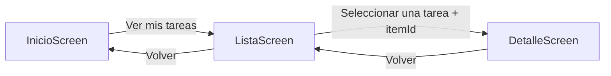

# TaskFlow — Gestor de tareas personales

1. Descripción

TaskFlow es una aplicación Android que permite al usuario organizar tareas personales de forma sencilla. La persona puede escribir su nombre, consultar una lista de tareas, agregar nuevas tareas, marcar tareas como completadas y abrir una pantalla con el detalle de cada elemento.

2. Problema que resuelve

Muchas personas olvidan actividades importantes o no tienen una forma rápida de visualizar lo que deben hacer. TaskFlow centraliza las tareas pendientes en una interfaz clara y permite actualizar su estado con pocos pasos.

2.1 Requerimientos funcionales

RF-01: El usuario podrá escribir su nombre en la pantalla de inicio.

RF-02: El sistema mostrará una lista desplazable de tareas.

RF-03: El usuario podrá agregar una tarea escribiendo un título.

RF-04: El usuario podrá marcar o desmarcar una tarea como completada.

RF-05: El usuario podrá seleccionar una tarea para consultar sus detalles.

RF-06: El sistema permitirá navegar entre Inicio, Lista y Detalle.

RF-07: La aplicación mostrará la cantidad total de tareas y las completadas.

2.2 Requerimientos no funcionales

La interfaz utilizará Jetpack Compose y Material 3.

La aplicación tendrá una estructura de paquetes organizada.

La aplicación deberá ejecutarse correctamente en un emulador AVD.

El código utilizará nombres claros y componentes reutilizables.

3. Pantallas

# | Nombre de pantalla | Descripción breve
--|--------------------|------------------
1 | InicioScreen       | Bienvenida, entrada del nombre, resumen y botón para abrir las tareas.
2 | ListaScreen        | Formulario para agregar tareas y LazyColumn con las tareas existentes.
3 | DetalleScreen      | Información completa de una tarea y botón para cambiar su estado.

4. Tecnologías usadas

Kotlin 2.x

Jetpack Compose

Material 3

Navigation Compose

Estado con remember, rememberSaveable y mutableStateListOf

Git y GitHub

5. Diagrama de navegación

Rutas utilizadas:

* inicio
* lista
* detalle/{itemId}

Ejemplo de ruta real: detalle/2.

6. Capturas de pantalla

